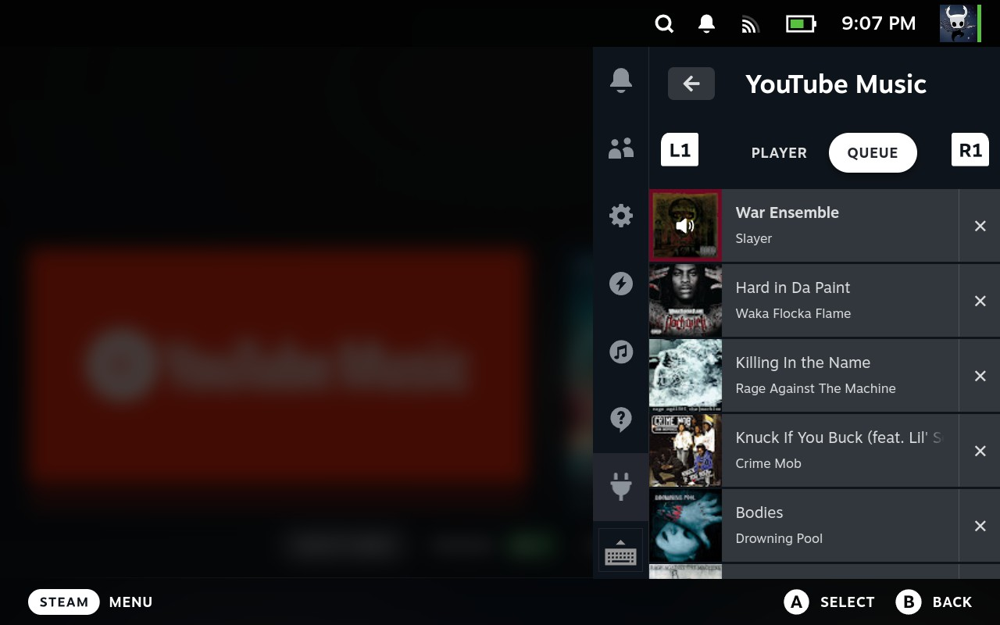

# YouTube Music for Decky

Control [YouTube Music](https://github.com/th-ch/youtube-music) from your Steam Deck sidebar using [Decky](https://decky.xyz/).

## Features

- **Player controls** — play, pause, skip, previous
- **Album art** — see what's playing at a glance
- **Volume slider** — adjust volume without leaving your game
- **Shuffle & Repeat** — toggle shuffle and cycle repeat modes
- **Queue management** — view your queue, jump to tracks, or remove them
- **L1/R1 tabs** — quickly switch between Player and Queue

## Requirements

- [Decky](https://decky.xyz/) installed on your Steam Deck
- [YouTube Music Desktop App](https://github.com/th-ch/youtube-music) (th-ch/youtube-music) installed and running in Game Mode
- The **API Server** plugin enabled in the YouTube Music desktop app

> **Important:** In the YouTube Music desktop app's API Server settings, set the authorization strategy to **"No authorization"**. This plugin does not currently support the API server's authorization mode.

## Installation

1. Download the latest `youtube-music.zip` from the [Releases](https://github.com/artistro08/decky-youtube-music/releases) page
2. Open Decky on your Steam Deck
3. Go to the Decky settings (gear icon)
4. Enable Developer Options
5. Go to the Developer Section
4. Select **Install from ZIP**
5. Choose the downloaded `youtube-music.zip`

## Setup

1. Install YouTube Music via flatpak.
2. Add YTM to Steam.
3. Go to **Plugins > API Server** and make sure it is enabled
4. Set the authorization strategy to **No authorization**
5. Return to Game Mode
6. Open the YouTube Music desktop app
6. Open the YouTube Music plugin

## License

MIT
